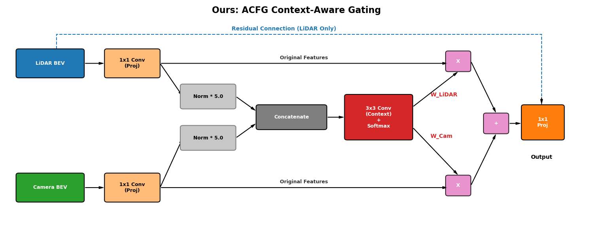
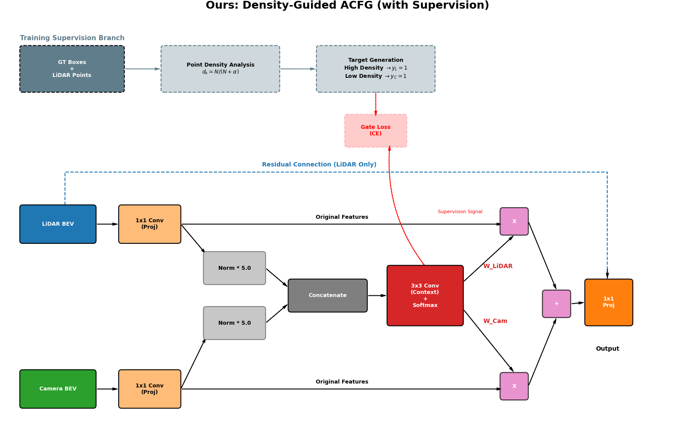
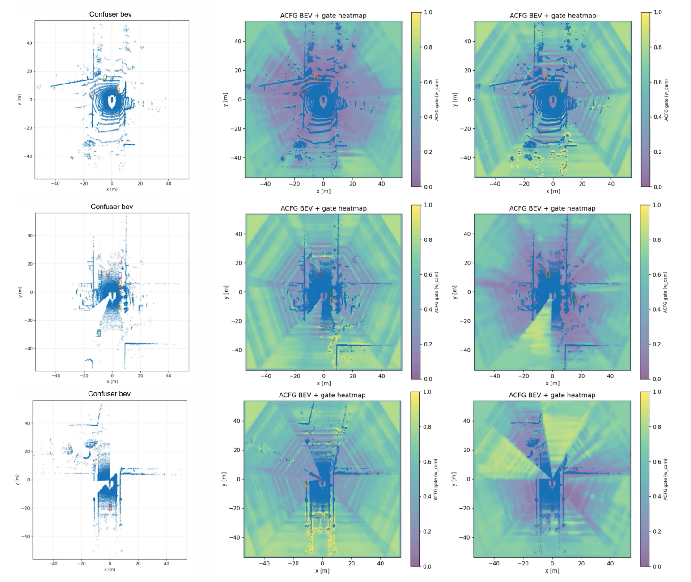

# ACFG BEV Fusion

This repository contains my custom modifications for robust LiDAR-camera BEV fusion built on top of OpenPCDet / BEVFusion.

## Overview
The main contribution is an **Adaptive Confidence Fusion Gate (ACFG)** that replaces the standard ConvFuser with an explicit spatially varying fusion module. This project also includes:
- an end-to-end ACFG variant,
- a GT-guided / density-guided supervised ACFG variant,
- LiDAR corruption processing for robustness experiments,
- BEV visualization scripts for qualitative analysis.

The goal is to improve robustness when LiDAR becomes unreliable under corruption while keeping the fusion behavior interpretable through per-cell modality weights.

## Method Variants
This repository includes two main model variants:

- **ACFG (end-to-end)**  
  Uses a context-aware gating module to predict spatially varying LiDAR / camera fusion weights directly from BEV features.

- **ACFG + supervision**  
  Adds a density-guided supervision signal for the gate using GT boxes and LiDAR point density as a reliability proxy.

## Figures

### ACFG Context-Aware Gating


### Density-Guided ACFG with Supervision


### Qualitative BEV Results and Gate Heatmaps


## Repository Contents
- `configs/bevfusion_acfg.yaml` — config for the end-to-end ACFG model
- `configs/bevfusion_acfg_gt.yaml` — config for the GT-guided / supervised ACFG model
- `pcdet/models/backbones_2d/fuser/acfg_fuser.py` — ACFG fusion head
- `pcdet/models/backbones_2d/fuser/acfg_fuser_gt.py` — supervised ACFG fusion head
- `pcdet/models/backbones_2d/fuser/__init__.py` — fuser module registration
- `pcdet/datasets/processor/data_processor.py` — modified data processor with corruption hook
- `pcdet/datasets/processor/lidar_corruption.py` — LiDAR corruption functions
- `tools/demo_acfg_gate_bev.py` — gate heatmap visualization
- `tools/demo_bevfusion_camratio_bev.py` — baseline camera-ratio BEV visualization
- `Report.pdf` — project report
- `Figures/` — architecture diagrams and qualitative results

## How to Use
This is **not** a full standalone detection framework. It is a compact extension repository that contains only the files I modified for this project.

To use it:
1. Prepare a working OpenPCDet / BEVFusion codebase.
2. Copy the files in this repository into the matching locations of the base project.
3. Use `bevfusion_acfg.yaml` or `bevfusion_acfg_gt.yaml` as the model config.
4. Train or evaluate within the original OpenPCDet workflow.

## Example Commands
Typical visualization commands look like:

```bash
python tools/demo_acfg_gate_bev.py --cfg_file configs/bevfusion_acfg.yaml --ckpt /path/to/checkpoint.pth --out_dir ./vis_results/acfg
python tools/demo_bevfusion_camratio_bev.py --cfg_file configs/bevfusion_acfg.yaml --ckpt /path/to/checkpoint.pth --out_dir ./vis_results/baseline
```

## Notes
- The original OpenPCDet / BEVFusion framework is not included in this repository.
- Datasets, pretrained weights, checkpoints, logs, and outputs are not included.
- This repository is intended to show my project-specific modules, configs, and visualization tools rather than to redistribute the entire upstream codebase.

## Repository Structure
```text
ACFG-BEV-Fusion/
├─ configs/
│  ├─ bevfusion_acfg.yaml
│  └─ bevfusion_acfg_gt.yaml
├─ pcdet/
│  ├─ models/
│  │  └─ backbones_2d/
│  │     └─ fuser/
│  │        ├─ __init__.py
│  │        ├─ acfg_fuser.py
│  │        └─ acfg_fuser_gt.py
│  └─ datasets/
│     └─ processor/
│        ├─ data_processor.py
│        └─ lidar_corruption.py
├─ tools/
│  ├─ demo_acfg_gate_bev.py
│  └─ demo_bevfusion_camratio_bev.py
├─ Figures/
│  ├─ acfg_context_gating.png
│  ├─ acfg_supervision_architecture.png
│  └─ qualitative_results.png
├─ Report.pdf
├─ requirements.txt
├─ .gitignore
└─ README.md
```
